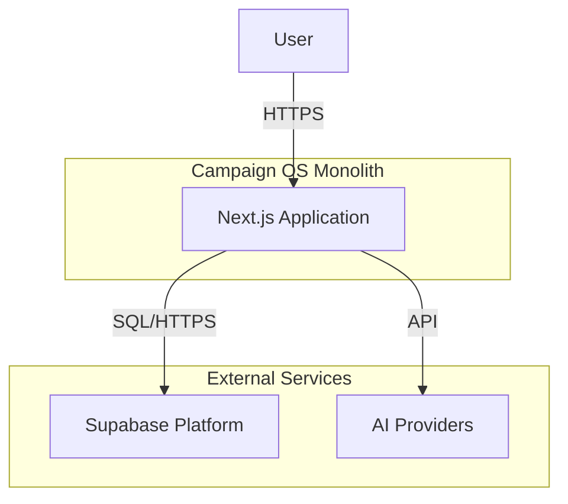

# Architecture Documentation

## 1. Executive Summary

**Campaign OS** is a monolithic web application designed for communication and social media campaign planning. It leverages a modern React-based stack to provide a responsive, interactive user experience with integrated AI capabilities.

The system is built on **Next.js 16 (App Router)**, using **Supabase** for backend services (Database, Auth) and **CopilotKit** for AI integration. It follows a **Client-Server** architecture where the Next.js server acts as an API gateway and rendering engine, while the browser handles rich interactivity.

## 2. System Context

The following diagram illustrates the high-level system context:

-   **User**: Interacts with the application via a web browser.
-   **Next.js Application**: The core application logic, serving UI and API endpoints.
-   **Supabase**: Managed PostgreSQL database and Authentication service.
-   **AI Providers**: External LLMs (OpenAI, Anthropic, etc.) accessed via CopilotKit.

## 3. Container Architecture

The application is structured as a single deployable unit (Monolith) using the Next.js App Router.

| Container | Technology | Responsibility |
|-----------|------------|----------------|
| **Web Server** | Next.js (Node.js) | Serves static assets, renders React Server Components (RSC), handles API routes. |
| **Client App** | React (Browser) | Handles client-side routing, state management, and interactivity. |
| **Database** | PostgreSQL (Supabase) | Persistent storage for all application data. |

### 3.1 Directory Structure & Responsibilities

-   **`app/`**: The root of the application.
    -   **`api/`**: Acts as the Backend-for-Frontend (BFF). Contains Route Handlers (`route.ts`) that execute server-side logic, validate requests, and interact with the database securely.
    -   **`[feature]/`**: Feature-specific routes (e.g., `campaigns/`). These use `page.tsx` as entry points.
-   **`components/`**: UI building blocks.
    -   **`ui/`**: "Dumb" presentation components (Buttons, Inputs) based on Radix UI.
    -   **`providers/`**: Context providers (e.g., `CopilotKitProvider`) that wrap the application.
-   **`lib/`**: Shared utilities.
    -   **`supabase/`**: Contains distinct clients for Server (`server.ts`) and Browser (`client.ts`) environments to handle authentication cookies correctly.

## 4. Component Design & State Management

The application uses a hybrid rendering model:

### 4.1 Server Components (RSC)
Used for the initial page load and static content.
-   **Responsibility**: Fetching initial data, rendering layout shell.
-   **Data Access**: Direct DB access via `lib/supabase/server.ts`.

### 4.2 Client Components ('use client')
Used for interactive elements (Forms, Lists, Dashboards).
-   **Responsibility**: Event handling, local state, browser APIs.
-   **Data Access**: Fetch data from internal API routes (`/api/*`) or via Supabase Client (`lib/supabase/client.ts`).
-   **State Management**: React `useState` and `useEffect` are used for local state. No global state library (Redux/Zustand) was observed; state is managed via composition and URL parameters.

### 4.3 Data Fetching Pattern
The `CampaignList` component demonstrates the standard pattern:
1.  Component mounts (`useEffect`).
2.  Fetches data from internal API (`fetch('/api/campaigns')`).
3.  Updates local state (`setCampaigns`).
4.  Renders UI with loading/error states.

*Note: This pattern suggests a move towards React Query or SWR could improve caching and optimistic updates in the future.*

## 5. Data Architecture

### 5.1 Database Schema
The database is a normalized PostgreSQL schema managed via Supabase Migrations (`supabase/migrations/`).
-   **Core Entities**: `campaigns`, `sprints`, `content_slots`.
-   **Relationships**: Enforced via Foreign Keys (e.g., `content_slots` -> `sprints` -> `campaigns`).
-   **Constraints**: Heavy use of Database constraints (CHECK constraints for Enums, Foreign Keys) ensures data integrity at the DB level.

### 5.2 Data Access Layer
-   **Server-Side**: Uses `@supabase/ssr` `createServerClient`. It reads cookies to authenticate the user for RLS policies.
-   **Client-Side**: Uses `@supabase/ssr` `createBrowserClient`. It manages the session automatically.

## 6. Security Architecture

### 6.1 Authentication
-   **Mechanism**: Supabase Auth (JWT based).
-   **Session Management**: HttpOnly cookies handled by `@supabase/ssr`.
-   **Flow**: Users log in -> Cookie set -> Next.js Middleware/Server passes cookie to Supabase -> Supabase validates JWT.

### 6.2 Authorization
-   **Row Level Security (RLS)**: Access control is implemented directly in the database.
    -   *Evidence*: Migration files like `...add_rls_to...`.
    -   *Policy*: Tables likely have policies like `auth.uid() = owner_id` (though specific policies need inspection of SQL files).
-   **API Security**: API Routes (`app/api/*`) instantiate the Supabase client with cookies. If the user is not authenticated, Supabase returns no data (or error), effectively securing the API.

## 7. AI Integration (CopilotKit)

The AI layer is integrated via the `CopilotKitProvider` in `app/layout.tsx`.

-   **Architecture**: Client-side Provider with Server-side Runtime.
-   **Components**:
    -   `CopilotKitProvider`: Wraps the app, configured with a runtime URL (`/api/copilotkit`).
    -   `CopilotKitErrorBoundary`: Custom error boundary to ensure AI failures don't crash the main UI.
-   **Data Flow**:
    1.  User interacts with Copilot UI (Chat/Textarea).
    2.  Request sent to `/api/copilotkit`.
    3.  Backend communicates with LLM Provider.
    4.  Response streamed back to Client.

## 8. Deployment & Infrastructure

-   **Platform**: Designed for Vercel (Next.js native) or any Docker-compatible host.
-   **Environment Variables**:
    -   `NEXT_PUBLIC_SUPABASE_URL`: Public API URL.
    -   `NEXT_PUBLIC_SUPABASE_ANON_KEY`: Public client key.
    -   `NEXT_PUBLIC_COPILOTKIT_RUNTIME_URL`: Endpoint for AI services.
-   **Build Process**: Standard Next.js build (`next build`).

## 9. Key Technical Decisions & Trade-offs

| Decision | Trade-off | Rationale |
|----------|-----------|-----------|
| **Monolith** | Simplicity vs. Scalability | Reduces operational complexity for the current team size. |
| **Supabase** | Vendor Lock-in vs. Velocity | Provides Auth, DB, and Realtime out-of-the-box, speeding up dev. |
| **Client-side Fetching** | SEO vs. Interactivity | Dashboard-heavy apps prioritize interactivity over SEO. |
| **Tailwind CSS** | Verbosity vs. Maintainability | Utility classes speed up styling and ensure consistency. |
